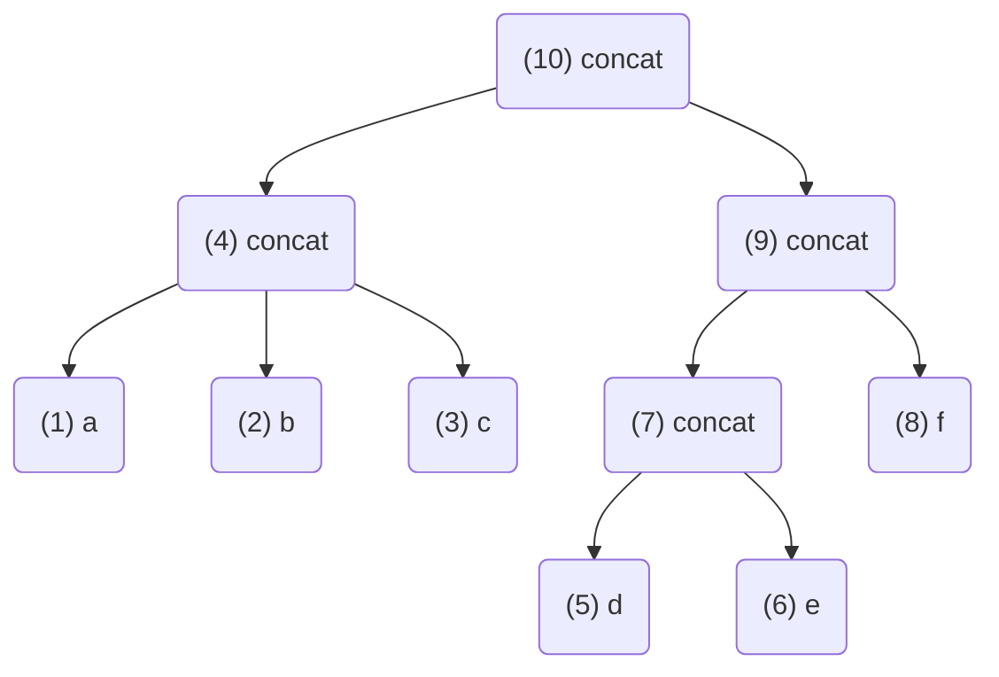

# LinGo

LinGo is a micro-language framework to design your **L**ISP-based Domain
Specific Languages (DSLs) **in Go**. The idea of LinGo is to provide a simple
extensible framework to build your own LISP-based micro-custom-DSLs that is
easily embeddable into your application in Go.

[[_TOC_]]

## Motivation

General purpose programming language are great for their application context.
Domain Specific Languages (DSLs) are geared towards solving a particular
problem from a specific domain; they are highly optimized towards their
specific application domain/context. Example DSLs include:
- [Regular Expressions](https://en.wikipedia.org/wiki/Regular_expression): Pattern Matching 
- [AWK](https://en.wikipedia.org/wiki/AWK): Text transformation
- [SQL](https://en.wikipedia.org/wiki/SQL): Querying relational databases

The tools for building DSLs (such as parser generators) have greatly improved
over the past decades but are rather syntax focused so that the evaluation
still has to be implemented manually. 

LinGo provides a re-useable foundation for syntactic processing as well as
S-expressions evaluation. The core idea is that you can plug-in custom
functions and types easily and built on top of the core-functionality provided
by lingo without having to re-invent the wheel. If you want to have a small,
simple, S-expression-based, extensible language that is embeddable as a Go
module, lingo may be a good fit.

## Directory Structure

This project contains two subdirectories `eval` and `parser`; `eval` hosts all
the functionality regarding evaluation of builtin functions whereas `parser`
covers all the functionality related to parsing.

## Usage

To compile LinGo you can simply run `go build`. After compilation you can run
the `lingo`.

For the majority of builtin functions, you can find test cases; the test-cases
can be executed with `go test -race -cover -v ./...`.

## Documentation

LinGo provides a foundation for building DSLs based on
[Symbolic Exressions](https://en.wikipedia.org/wiki/S-expression), i.e., expressions
provided in the form of nested lists. New functions support can be added by
just implementing an interface. The sections below explain the core concepts of
LinGo.

### Symbolic expressions (S-expressions)

S-expressions in [prefix notation](https://en.wikipedia.org/wiki/Polish_notation) serve as a foundation
for builing new DSLs. S-expressions are concise and easy to process and are
can be used to consistently represent code and data.

We broadly differentiate between two types of S-expressions: (1) atoms (numbers,
strings, symbols) and (2) lists, i.e., nested S-expressions. 

For example the S-expression `(add (add 1 2) 2 3)` is a list that includes one
list and two atomic sub-S-expressions: the list/sub-expression `(add 1 2)` as
well as the numbers `2`, and `3`.

S-expressions are very easy to parse because of their uniformity, i.e., every
expression has the same structure, and a very limited set of tokens to
consider. In addition they are flexible in the sense that the semantics of an
expression is encoded by the first symbol that appears in its list. Hence the
S-expression parser does not have to be aware of constraints associated with
the semantics of the expression it processes. The parser core implementation
just cares about the basic syntactic elements, i.e., lists and atoms. 

LinGo is designed in such a way that new functions can be plugged-in by
implementing an interface and registering the newly implemented function to
make it available. 

### Data-types

At the moment, the core implementation of LinGo supports the [following types](eval/types.go):

1. String: a string enclosed in double quotes
1. Keyword: a keyword starting with `:`
1. Integer: a number
1. Symbol: symbols are used to identify functions and variables
1. Dictionary: associative database
1. Vector: list with index-based access
1. Nil: empty set

The types above are wrapped by the [`Result` interface](eval/env.go), i.e., the
result returned by the evaluation of an S-expression.

### Core language

If you run `(desc)` withing the LinGo read-eval-print loop, you get a list of
all the built-in functions currently provided by LinGo. The functions marked as
`[Internal]` are not directly exposed but can be used as building blocks when
adding new custom functions.

``` bash
 > (desc)
+----------------------+--------------------------------+
|       COMMAND        |          DESCRIPTION           |
+----------------------+--------------------------------+
| (desc :x)            | Provide a description for the  |
|                      | function identified by the     |
|                      | keyword x                      |
+----------------------+--------------------------------+
| (root a)             | Evaluates the subexpression    |
|                      | and propagates the result      |
|                      | [Internal]                     |
+----------------------+--------------------------------+
| (dict (p0) ... (pN)) | Generates a dictionary from    |
|                      | a sequence of pairs (pX)       |
|                      | [Internal]                     |
+----------------------+--------------------------------+
| (vec (p0) ... (pN))  | Generate a vector from         |
|                      | (string|int|keyword)           |
|                      | subexpressions pX [Internal]   |
+----------------------+--------------------------------+
| (add a b)            | Add numeric sub-expressions a  |
|                      | and b                          |
+----------------------+--------------------------------+
| (concat a b)         | Concatenates string            |
|                      | sub-expressions a and b        |
+----------------------+--------------------------------+
| (def a b)            | Declare variable a and bind    |
|                      | it to the result yielded by    |
|                      | expression b                   |
+----------------------+--------------------------------+
| (bindings)           | List all bindings in the       |
|                      | current environment            |
+----------------------+--------------------------------+
| (resolve a)          | Resolves variable a [Internal] |
+----------------------+--------------------------------+
| (tidy)               | Cleanup the environment        |
+----------------------+--------------------------------+
| (pair :a b)          | Generate a data pair with the  |
|                      | symbol a and the result of the |
|                      | (string|int) sub-expression b  |
|                      | [Internal]                     |
+----------------------+--------------------------------+
```

All the functions listed above, are available in the [`eval` directory](eval).

### Evaluator

An [evaluator](eval/eval.go) is responsible for managing the evaluation and
invoking the correct functions based on the S-expression symbols.

Let's assume, we would like to process the S-expression below. 

``` bash
(concat 
    (concat 
        "a" 
        "b" 
        "c"
    ) 
    (concat 
        (concat 
            "d" 
            "e"
        ) 
        "f"
    )
)
```

From the input above, LinGo produces the tree below:



For the purpose of evaluating the expression, LinGo performs a depth-first (DF)
traversal in post-order. Post-order traversal ensures that the child-nodes are
processed before the parent in order to implement a bottom up evaluation. The
order in which the nodes are processed is denoted with the numbers visible in
the node labels above. 

The evaluator starts with nodes 1,2 and 3 and pushes then onto the stack in
this order. Afterwards, when visiting node 4, the evaluator invokes the list
expression `concat` which is provided as a [function plugin](eval/concat.go)
and passes a stack-frame with the previously pushed elements to it. When
invoking the function plugin, `concat` pops all three elements from the stack
and concatenates them. Afterwards it pushes the result of the evaluation `abc`
onto the stack; the evaluator then proceeds with node 5. Once the evaluator
reaches node 10, it passes the results that have been computed for nodes 4 and
9 onto the stack and passes the stack-frame to node 10 which computes the final
result `abcdef`.

```
lingo> (concat (concat "a" "b" "c") (concat (concat "d" "e") "f"))
abcdef
```

The evaluation algorithm is generic in the sense that the core implementation
does not have to be touched when adding support for new functions.

### Data Types and Results

We differentiate between (data) types and results. Data types indicate how data
is supposed to be used and result objects are used to pass intermediate
results between functions where every result has a unique type. 

New types can be registered by invoking `eval.NewType(<typename>)`; every
result kind has to implement the interface below.

``` golang
// Result represents values computed by and passed between the functions that 
// evaluate S-expressions
type Result interface {
    // A string that describes the result
	String() string
    // Result type
	Type() Type
    // Result value
	Value() interface{}
    // Setter
	SetValue(interface{}) error
    // A cleanup callback function that is invoked when the enviroment is
    cleaned up
	Tidy()
}
```

### A plugin mechanism for new functions

LinGo supports the integration of new functions by implementing the
`Function` interface. You can find a detailed description regarding the
different interface methods in the snippet below.

``` go
// Function is an interface to add new functionality
type Function interface {
    // Desc returns documentation showing the structure of the command and a
    // description text
	Desc() (string, string)
    // Symbol returns the symbol under which the function is available
	Symbol() parser.TokLabel
    // Validate return an error if there is a mismatch between the parameters
    // on the stack and the function requirements
	Validate(env *Environment, stack *StackFrame) error
    // Evaluate implements the function semantics and returns a Result object
    // that wraps the results of the computation
	Evaluate(env *Environment, stack *StackFrame) (Result, error)
}
```

The `Symbol` function is the function that is used to resolve functions by the
evaluator; for example the `concat` function we saw earlier provides the
following implementation:

``` go 
func (f *FunctionConcat) Symbol() parser.TokLabel {
	return parser.TokLabel("concat")
}
```

After implementing a new function, you can just add it to the 
[builtins map](eval/function.go) so that the evaluator can resolve it.

```
var builtins = map[parser.TokLabel]Function{
	funconcat.Symbol(): funconcat,
    // ...
}
```

#### Example

The example below shows how you can implement the binary function greater-than
`gt` that compares two numeric expressions and returns true if the first
expression yields a value greater than the second expression. This problem can
be solved by implementing the `Function` interface and registering it by
executing `eval.HookFunction(fn)`.

``` golang
type FunctionGt struct{}
// Implement the Function interface
func (f *FunctionGt) Desc() (string, string) {
	return fmt.Sprintf("%s%s %s%s",
			string(parser.TokLeftPar),
			f.Symbol(),
			"a b",
			string(parser.TokRightPar)),
		"Cmp if a > b numeric sub-expressions of a b"
}
func (f *FunctionGt) Symbol() parser.TokLabel {
	return parser.TokLabel("gt")
}
func (f *FunctionGt) Validate(env *eval.Environment, stack *eval.StackFrame) error {
	if stack.Empty() {
		return eval.TooFewArgs(f.Symbol(), 0, 1)
	}

	for idx, item := range stack.Items() { 
		if item.Type() != types.TypeInt {
			return eval.WrongTypeOfArg(f.Symbol(), idx+1, item)
		}
	}
	return nil
}
func (f *FunctionGt) Evaluate(env *eval.Environment, stack *eval.StackFrame) (eval.Result, error) {
	result := NewBoolResult(false)
	for !stack.Empty() {
		itemA := stack.Pop().(*eval.IntResult)
		itemB := stack.Pop().(*eval.IntResult)
		result.SetValue(itemB.Val > itemA.Val)
	}

	return result, nil
}
func NewFunctionGt() (eval.Function, error) {
	fun := &FunctionGt{}
	_, err := parser.HookToken(fun.Symbol(), true)
	if err != nil {
		return nil, err
	}
	return fun, nil
}

func main() {
	fn, err = NewFunctionGt()
	if err != nil {
        log.Fatalf("failed to create gt function %s:", err.Error())
	}
    err = eval.HookFunction(fn) 
	if err != nil {
        log.Fatalf("failed to hook gt function %s:", err.Error())
	}

    eval.RunLoop()
}
```

Below you can see an example execution/application of the newly introduced
function.

``` 
lingo> (gt (add 1 2 3) (add 6 4))
false
```

### A plugin mechanism for new Types

LinGo supports plugging in in new custom types; for this purpose, LinGo uses a
concept called *furnishing function* that adds semantics to a plugged in type
and makes it available. 

Adding a new custom type is a four step process:
1. Register the type with `parser.HookToken(<typename>)` and 
   a corresponding token matcher that implements the `TokMatcher`
   interface.
``` golang
type TokMatcher interface {
	Match(s string) TokLabel
	Id() string
}
```
1. Add a new result-type by implementing the `Result` interface for the purpose of
   passing values that adhere to the newly introduced types between function
   with the constraint that the `Type()` method returns the newly introduced
   type.
1. Introducing a furnishing function that recognizes the new types and makes it
   available to be used an passed around by functions. A furnishing function
   implements the `Function` interface with the condition that `Type()` returns
   the newly registered type and `Evaluate(...) (Result, error)` returns the
   newly introduced result-type.

#### Example

In the example below, we are introducing a new type called `bool` to represent
boolean values. `BoolMatcher` enables the LinGo lexer to recognize boolean
values `true` and `false` and tags them as boolean values. `FunctionBool` is
the furnishing function that lifts the generic `eval.CharSequenceResult` to an
actual boolean. `BoolResult` represent a boolean value for the computation

The example below also introduces a function `FunctionAdd` that applies a
logical conjunction function on the sub-expressions that are passed to it as
arguments.

``` golang
// introducing a new type
var TypeBoolId, TypeBool = eval.NewType("bool")
// introduce a new token for the boolean type
var tokBool = parser.HookToken(parser.TokLabel(TypeBool.Name), false)

// extend lexical analysis to recognize (true, false) as boolean
type BoolMatcher struct{}
func (i BoolMatcher) Match(s string) parser.TokLabel {
	if strings.ToLower(s) == "true" || strings.ToLower(s) == "false" {
		return tokBool.Label
	}
	return parser.TokUnknown
}
func (i BoolMatcher) Id() string {
	return string(tokBool.Label)
}

func init() {
     parser.HookMatcher(BoolMatcher{})
}

// used by the evaluator to perform computations on booleans
type BoolResult struct { value bool }
func (r BoolResult) String() string {
	if r.value {
		return "true"
	}
	return "false"
}
func (r BoolResult) Type() types.Type { return TypeBool }
func (r BoolResult) Tidy() {}
func (r BoolResult) Value() interface{} { return r.value }
func (r *BoolResult) SetValue(value interface{}) error {
	boolVal, ok := value.(bool)
	if !ok {
		return fmt.Errorf("invalid type for Bool")
	}
	r.value = boolVal
	return nil
}
func NewBoolResult(value bool) *BoolResult {
	return &BoolResult{
		value,
	}
}

// furnishing function for booleans
type FunctionBool struct{}
func (f *FunctionBool) Desc() (string, string) {
	return fmt.Sprintf("%s%s %s%s",
			string(parser.TokLeftPar),
			f.Symbol(),
			"x",
			string(parser.TokRightPar)),
		"lift a character sequence to a boolean result [Internal]"
}
func (f *FunctionBool) Symbol() parser.TokLabel {
	return tokBool.Label
}
func (f *FunctionBool) Validate(env *eval.Environment, stack *eval.StackFrame) error {
    if stack.Size() != 1 {
        return eval.TooFewArgs(f.Symbol(), 0, 1)
    }
    if stack.Peek().Type() != types.TypeCharSequence {
        return eval.WrongTypeOfArg(f.Symbol(), 1, stack.Peek())
    }
    
    boolval := stack.Peek().(*eval.CharSequenceResult)
    boolvals := strings.ToLower(boolval.Val)

    if boolvals != "true" && boolvals != "false" {
        return fmt.Errorf("boolean value should be either true or false")
    }

    return nil
}
func (f *FunctionBool) Evaluate(env *eval.Environment, stack *eval.StackFrame) (eval.Result, error) {
    item := stack.Pop().(*eval.CharSequenceResult)

    boolval := item.Val
    boolval = strings.ToLower(boolval)

    var result bool
    if boolval == "true" {
        result = true
    } else if boolval == "false" {
        result = false 
    }

	return NewBoolResult(result), nil
}

func NewFunctionBool() (eval.Function, error) {
	fun := &FunctionBool{}
	return fun, nil
}

type FunctionAnd struct{}
func (f *FunctionAnd) Desc() (string, string) {
	return fmt.Sprintf("%s%s %s%s",
			string(parser.TokLeftPar),
			f.Symbol(),
			"p0 ... pN",
			string(parser.TokRightPar)),
		"apply logical and on sub-expressions"
}
func (f *FunctionAnd) Symbol() parser.TokLabel {
	return parser.TokLabel("and")
}
func (f *FunctionAnd) Validate(env *eval.Environment, stack *eval.StackFrame) error {
	if stack.Empty() {
		return eval.TooFewArgs(f.Symbol(), 0, 1)
	}

	for idx, item := range stack.Items() { 
		if item.Type() != TypeBool {
			return eval.WrongTypeOfArg(f.Symbol(), idx+1, item)
		}
	}
	return nil
}
func (f *FunctionAnd) Evaluate(env *eval.Environment, stack *eval.StackFrame) (eval.Result, error) {
    result := true
    for !stack.Empty() {
		item := stack.Pop().(*BoolResult)
        result = result && item.value
	}
    
    return NewBoolResult(result), nil
}

func NewFunctionAnd() (eval.Function, error) {
	fun := &FunctionAnd{}
	parser.HookToken(fun.Symbol(), true)
	return fun, nil
}


func main() {
    // Function to recognize new bool type
    fn, err := NewFunctionBool()
	if err != nil {
        log.Fatalf("failed to create bool function %s:", err.Error())
	}
    err = eval.HookFunction(fn) 
	if err != nil {
        log.Fatalf("failed to hook bool function %s:", err.Error())
	}

    // Function to recognize new bool type
    fn, err = NewFunctionAnd()
	if err != nil {
        log.Fatalf("failed to create and function %s:", err.Error())
	}
    err = eval.HookFunction(fn) 
	if err != nil {
        log.Fatalf("failed to hook and function %s:", err.Error())
	}

    eval.RunLoop()
}
```

Below you can see an example execution/application of the newly introduced
function.

``` bash
lingo> (and (gt 5 4) (gt 4 1))
true
```

### Macro System

Lingo supports a simple macro system. Macros are different from functions in
the sense that they are not evaluated. Instead, macros are used to translate a
given S-expression `s` into another S-expression `s'` by applying
transformation rules. Macros are useful because they are not limited by the
strict rules applied during function evaluation; they also make it easy to add
new capabilities to the language by providing shortcuts/syntacic sugar to
express more complex operations in terms of simpler ones and, thus, adding
utility without having to alter the core language.

We explain the macro system by means of the [thread-first](https://clojure.org/guides/threading_macros) macros, 
or more specifically the thread-first macro, which is often used in the Clojure
world.

#### Threading macro

Threading macros reduce the "nestedness" and, thus improve readability. The
S-expression below evalutes to the string `hellothisisatest`. You can see many
nested calls to the `concat` function. In oder to understand the results
yielded by the evaluation of this S-expression, it has to be read from the
inside out.

```
(concat (concat (concat (concat "hello" "this" ) "is" ) "a" ) "test" ) 
```

In order to improve readability, threading macros reduce the nestedness. Below,
you can see an example of an expression using the thread-first macro. The
expression below is semantically equivalent to the S-expression above but more
readable and easier to reason about since we can read it from left to right.
Intuitively, you can think of the expression below as a UNIX pipe where data is
piped from left to right.

```
(-> "hello" (concat "this") (concat "is") (concat "a") (concat "test"))
```

The expression above is not evaluated; instead a corresponding transformation
rule transparently translates it into the nested S-expression of concat
functions from the beginning of this section which can then then be evaluted.
The tranformation works recursively by passing an expression (for example the
atomic S-expression `"hello"`) to its succeeding S-expression as a first argument
so that `"hello" (concat "this")` is transformed into `(concat "hello" "this")`.

Lingo natively supports these types of transformations by means of the
`MacroVisitor` interface which is explained below.

``` golang
// MacroVisitor is the interface for macro transformations
type MacroVisitor interface {
    // Name of the macro
    Identifier() string
    // Transformation result
    Result() (*parser.Sexpression, error)
    // Called before the transformation 
	Before()
    // Called when entering the nodes of the source S-expression
	Enter(expression *parser.Sexpression) (bool, error)
    // Called when leaving the nodes of the source S-expression
	Leave(expression *parser.Sexpression) error
    // Called after the transformation
	After()
}
```

Similar as for the S-expression evaluation, we are also using a depth-first
(DF) traversal in post-order; you can control which nodes to skip by returning
`false` for those nodes that should be skipped in the `Enter` call.
`Identifier` returns the name of the macro which is `->` for the thread-first
macro. `Result` returns the new S-expression that has been yielded by applying
the transformation.

The implementation of the thread-first macro can be found under
[macro/threadfirst.go](eval/treadfirst.go). You can register your own macros by
calling `macro.HookMacro` with your custom implementation of the
`MacroVisitor`.

# License

The MIT License (MIT)

Copyright (c) 2022, Vulnerability Research, GitLab Inc.

Permission is hereby granted, free of charge, to any person obtaining a copy of
this software and associated documentation files (the "Software"), to deal in
the Software without restriction, including without limitation the rights to
use, copy, modify, merge, publish, distribute, sublicense, and/or sell copies of
the Software, and to permit persons to whom the Software is furnished to do so,
subject to the following conditions:

The above copyright notice and this permission notice shall be included in all
copies or substantial portions of the Software.

THE SOFTWARE IS PROVIDED "AS IS", WITHOUT WARRANTY OF ANY KIND, EXPRESS OR
IMPLIED, INCLUDING BUT NOT LIMITED TO THE WARRANTIES OF MERCHANTABILITY, FITNESS
FOR A PARTICULAR PURPOSE AND NONINFRINGEMENT. IN NO EVENT SHALL THE AUTHORS OR
COPYRIGHT HOLDERS BE LIABLE FOR ANY CLAIM, DAMAGES OR OTHER LIABILITY, WHETHER
IN AN ACTION OF CONTRACT, TORT OR OTHERWISE, ARISING FROM, OUT OF OR IN
CONNECTION WITH THE SOFTWARE OR THE USE OR OTHER DEALINGS IN THE SOFTWARE.

## Contributing

See [CONTRIBUTING.md](CONTRIBUTING.md).
